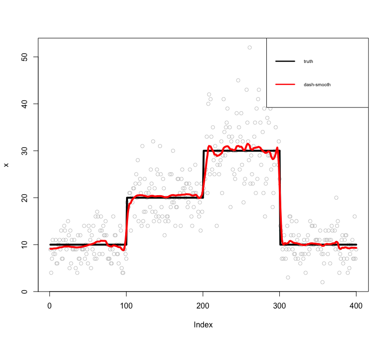

# dash - Dirichlet adaptive shrinkage for compositional data with applications in smoothing


- Authors:    [Kushal K Dey](https://github.com/kkdey),   [Zhengrong Xing](https://github.com/zrxing), [Dongyue Xie](https://github.com/DongyueXie), [Matthew Stephens](http://stephenslab.uchicago.edu/)


## Description

**dashr** is a companion package to the [ashr](https://github.com/stephens999/ashr) package by Matthew Stephens (see [paper](https://academic.oup.com/biostatistics/article/18/2/275/2557030) here) which is aimed at adaptive shrinkage of compositional counts data. 

This model assumes a mixture Dirichlet distribution for the true compositional proportions of categories, with the flexibility that the mixture may in theory comprise of infinitely many components of varying concentrations but all having the same known mean. The mixing proportions of these components are estimated from the model

When there are only two categories of composition, the mixture Dirichlet distribution would essentially reduce to mixture Beta distribution and **dashr** uses this distribution to model the message flow proportions along a Poisson multiscale tree model for time varying counts data to perform adaptive smoothing

## Installation 

To install the **dashr** package, please install the dependencies if not loaded already.

```{r,warning=FALSE,message=FALSE,fig.width=7,fig.height=7}
install.packages("devtools")
install.packages("Rcpp")
install.packages("inline")
install.packages("LaplacesDemon")
devtools::install_github("stephens999/ashr")
```

To perform the logo plot representations, please install the [Logolas](https://github.com/kkdey/Logolas)
package and for comparing with the SMASH output as in the vignettes, please install the [smashr](https://github.com/stephenslab/smashr) package. 

Then install the **dashr**  package.

```{r,warning=FALSE,message=FALSE,fig.width=7,fig.height=7}
devtools::install_github("kkdey/dashr")
```
and then load the package in your R environment.

```{r,warning=FALSE,message=FALSE,fig.width=7,fig.height=7}
library(dashr)
```

## Methods and Materials

For a more detailed description of the models underlying the **dashr** package, together with example applications, please check our [vignette](vignettes/dashr.html).


##  Example Applications of dash 

We first provide an example application of **dashr** for shrinking the base compositional probabilities in a simulated Trasncription Factor Binding Site (TFBS) example. We first generate the compositional counts data under this setting. 

```{r,warning=FALSE,message=FALSE,fig.width=7,fig.height=7}

xmat <- cbind(c(5, 0, 2, 0),
              c(1, 1, 0, 1),
              c(100, 100, 50, 100),
              c(20, 50, 100, 10),
              c(10, 10, 200, 20),
              c(50, 54, 58, 53),
              c(1,1,1,3),
              c(2, 4, 1, 1))
rownames(xmat) <- c("A", "C", "G", "T")
colnames(xmat) <- paste0("pos-", 1:dim(xmat)[2])
xmat_norm <- apply(xmat, 2, function(x) return(x/sum(x)))

xmat
```

We then fit the Dirichlet adaptive shrinkage (dash) model to the above compositional counts matrix. 


```{r,warning=FALSE,message=FALSE,fig.width=7,fig.height=7}
out <- dash(xmat, optmethod = "mixEM", verbose=FALSE, bf=TRUE)
```

We present the logo plot representations (package [Logolas](kkdey.github.io/Logolas-pages)) of the compositional weight matrix.

```{r}
grid.newpage()
layout.rows <- 1
layout.cols <- 2
top.vp <- viewport(layout=grid.layout(layout.rows, layout.cols,
                                      widths=unit(rep(6,layout.cols), rep("null", 2)),
                                      heights=unit(c(20,50), rep("lines", 2))))

plot_reg <- vpList()
l <- 1
for(i in 1:layout.rows){
  for(j in 1:layout.cols){
    plot_reg[[l]] <- viewport(layout.pos.col = j, layout.pos.row = i, name = paste0("plotlogo", l))
    l <- l+1
  }
}


plot_tree <- vpTree(top.vp, plot_reg)

color_profile = list("type" = "per_row", 
                     "col" = RColorBrewer::brewer.pal(4,name ="Spectral"))

pushViewport(plot_tree)
seekViewport(paste0("plotlogo", 1))
logomaker(xmat_norm,color_profile = color_profile,
          frame_width = 1,
          pop_name = "pre dash PWM",
          newpage = F)

seekViewport(paste0('plotlogo',2))
logomaker(out$posmean,color_profile = color_profile,
          frame_width = 1,
          pop_name = "post dash PWM",
          newpage = F)
```


We now present an example illustration of adaptive smoothing using the **dashr** package.

```{r}
mu <- c(rep(10, 100), rep(20, 100), rep(30, 100), rep(10, 100))
x <- sapply(mu, function(x) rpois(1,x))

out <- dashr::dash_smooth(x)

plot(x, col = "gray80")
lines(mu, col = "black", lwd = 4)
lines(out$estimate, col = "red", lwd = 4)
legend("topright", # places a legend at the appropriate place
       c("truth","dash-smooth"), # puts text in the legend
       lty=c(1,1), # gives the legend appropriate symbols (lines)
       lwd=c(2.5,2.5),
       cex = 0.6,
       col=c("black","red"))
```



## License 

The **dashr** package is availabel under GPL (>=2) license.

## Acknowledgements

The authors would like to acknowledge Peter Carbonetto for helpful feedback.

## Contact

For any queries or questions or bugs, please open an issue in this Github page or write to Kushal K Dey at [kshldey@gmail.com](kshldey@gmail.com). 


